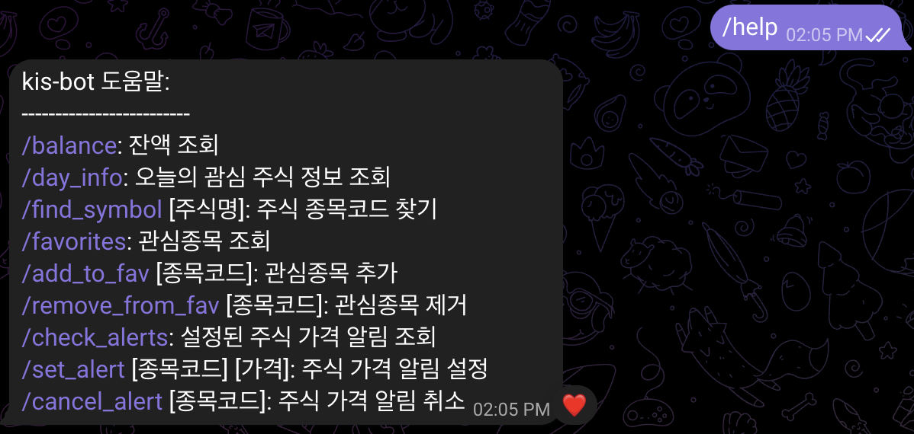

# SSIT 2024 여름방학 - 기깔나는 코딩스터디

## week 1
- git에 대한 이해 및 사용법
- beautifulsoup, requests를 이용한 웹 크롤링의 기초
- branch:
  - `1-crawling-basics-skeleton`
  - `1-crawling-basics-sol`

## week 2
- 주식 자동 매매 프로그램 intro
- 한국투자증권 openAPI를 이용
- branch:
  - `2-kis-intro-skeleton`
  - `2-kis-intro-sol`

## week 3
- 국내 주식 종목 조회 및 국내 주식 매수/매도 
- branch:
  - `3-kis-korea-skeleton`
  - `3-kis-korea-sol`

## week 4
- 텔레그램을 이용해 bot 만들기
- command handler, job queue 등 이용
- 주식 정보, 특정 가격 도달, 주기적 업데이트, 관심종목 알림 등 구현
- branch:
  - `4-telegram-skeleton`
  - `4-telegram-sol`

